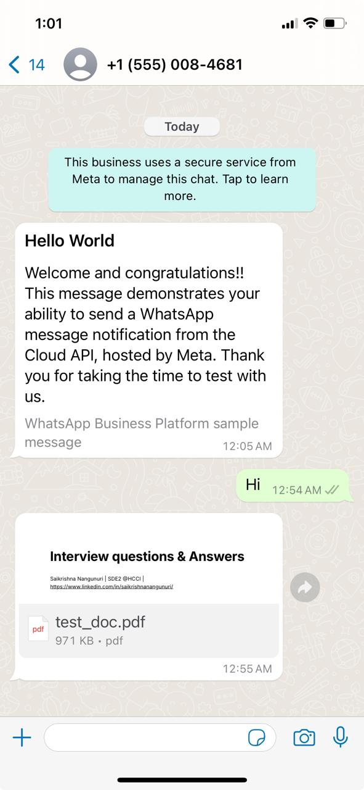

## Problem Statement
Please create an API for sending a PDF file to a WhatsApp number using the WhatsApp Cloud API. Refer to the documentation provided in the link below for guidance:
https://developers.facebook.com/docs/whatsapp/cloud-api/reference/media/

## Documentation
1) Initial Project Setup :- npm install
2) Replace your accessToken and phoneNumberId in the app.js file.
3) Send a request to the API using Postman with form-data in the body, including fields for to and pdf.
3) Running the project :- npm run dev

## Work Samples 

